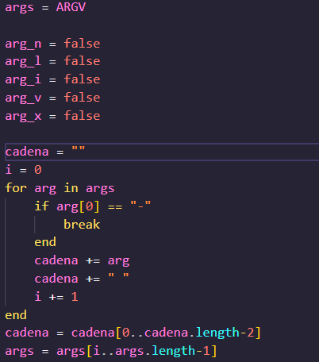
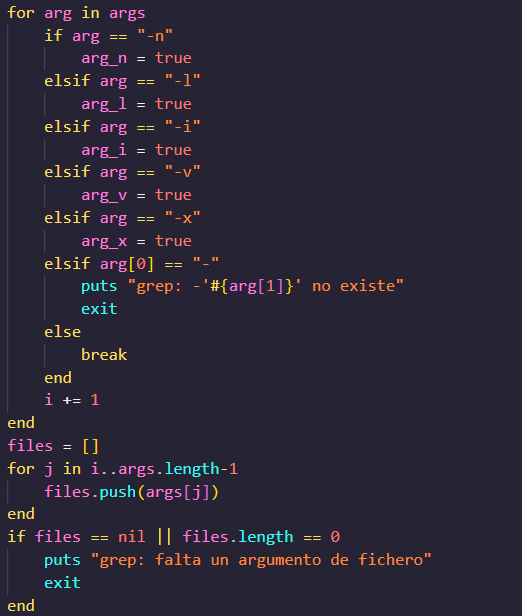
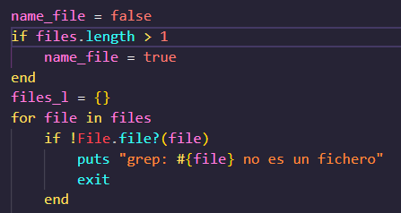
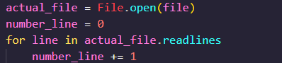
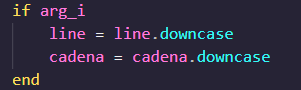
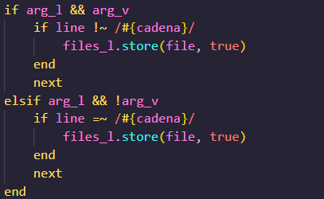
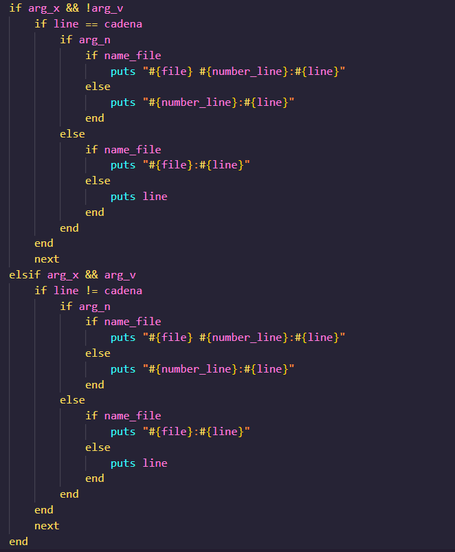
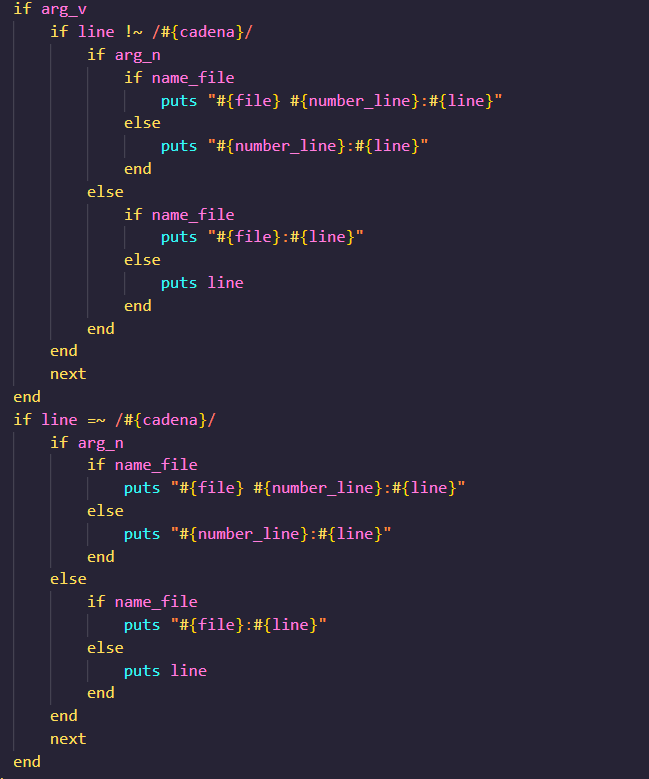

# Parte 1
Pregunta 1
En esta parte implementaremos el comando grep en ruby.
Lo que haremos primero será obtener la cadena a buscar y crear las flags que se utilizarán en el comando grep.

Ahora obtendremos las flags y los archivos

Creamos variables de apoyo y revisamos que los archivos existan

Iteramos sobre los archivos y leemos cada línea

Ahora verificamos la flag -i si existe entonces convertimos la línea y la cadena a buscar a minúsculas para que no haya problemas con la comparación

Ahora la flag -v se usará en las siguiente comparaciones, si la cadena a buscar no se encuentra en la línea entonces se imprime la línea

Para la flag -l almacena los nombres de los archivos en los que la línea existe y se imprime el nombre del archivo

Para el flag -x se compara toda la línea con la cadena a buscar, si son iguales entonces se imprime la línea

Ahora el argumento -v se usa para imprimir las líneas que no coinciden con la cadena a buscar, en este caso cuando ninguna de las otras flags se cumple
A la vez se usa el argument -n para imprimir el número de línea

Parte 3
1. Si los métodos de clase son métodos de instancia, ¿qué clase contiene esos métodos de instancia?
La clase que contiene los métodos de instancia es la clase Class.

4. ¿Cuál es el requisito previo más importante antes de comenzar una refactorización?
Creo que lo más importante es tener buenas pruebas unitarias, ya que al refactorizar el código entonces podremos ver si las pruebas siguen pasando o no.

5. ¿Es mejor utilizar un enfoque de desarrollo del lado del cliente o del lado del servidor al diseñar una aplicación que implica la entrada de datos a través de formularios HTML?
En este caso es mejor utilizar un enfoque del lado del servidor, ya que así podremos tener un mayor control de los datos que son enviados, sanitizarlos y validarlos, y así poder evitar que se envíen datos maliciosos o que no cumplan con los requisitos.
