# Parte 2
Ejecutamos el comando rails new todo_app para crear una nueva aplicación
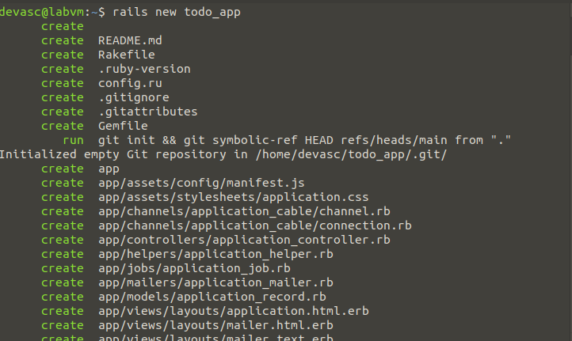

Ahora nos vamos a ese directorio y ejecutamos rails generate scaffold todo description:string
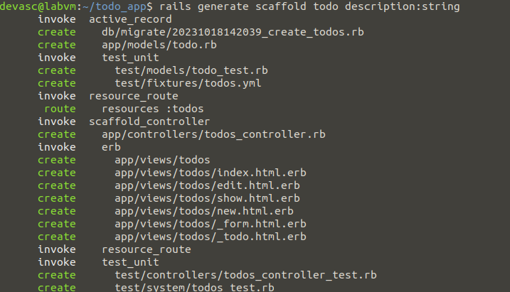

Ahora para inicializar la base de datos podemos usar bundle exec rake db:migrate
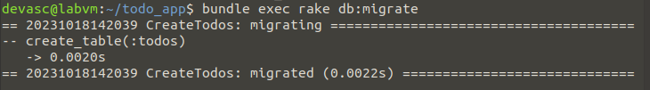

Ahora copiamos los registros del Todo en db/seeds.rb para luego agregarlos a la base de datos usando rake db:seed
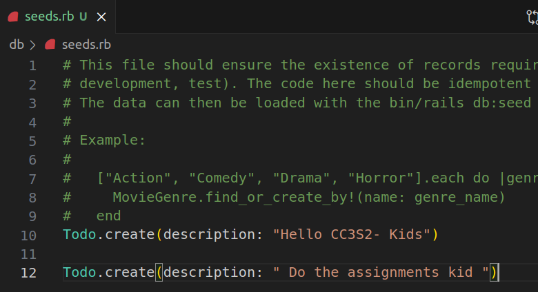

Para verificar que los registros se agregaron usaremos la consola interactiva de rails

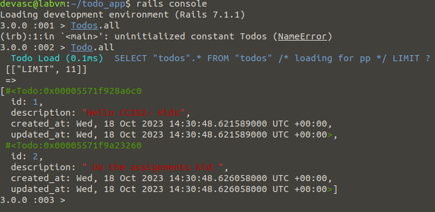

Ahora corremos el servidor y vemos que en la ruta /todos nos aparece una lista con los registros de la base de datos
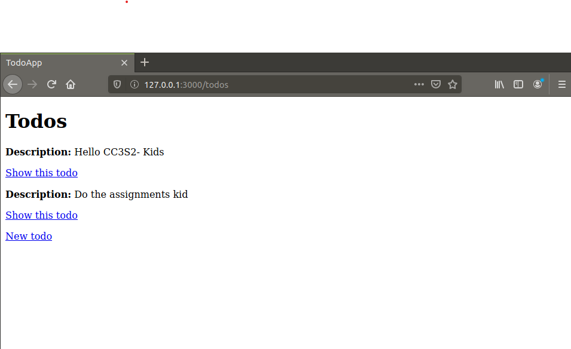

Ahora para agregar la fecha límite del todo usamos el comando rails generate migration AgregarFecha due_date:datetime y luego hacemos otra migración
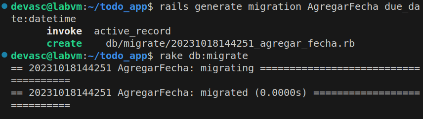

Vemos que se creó un nuevo archivo de migrate
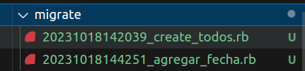

Ahora agregaremos un ruta /hello a la apliación, así mismo crearemos su .html.erb y agregaremos la función de respuesta al controlador, y así podremos visualizarla
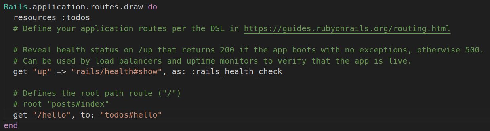
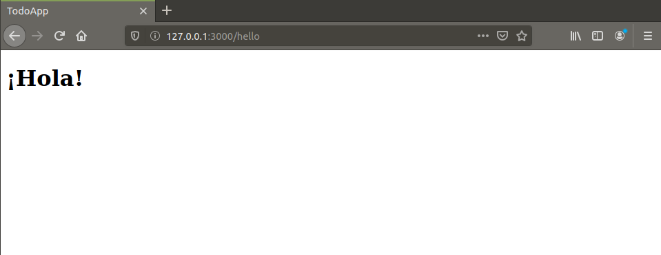

Ahora volveremos a cambiar la base de datos para agregar el booleano de Done
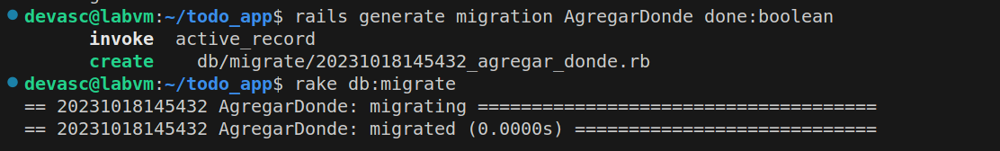

Cambiamos el todo_params del controlador para que acepte el booleano done, además cambiamos los archivos de la vista que muestra el todo y el formulario de editarlo también
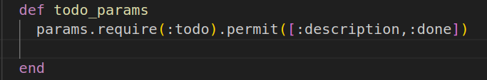

También en el archivo de migración completamos la función change 
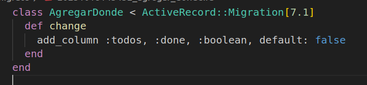

Vemos la página con el done
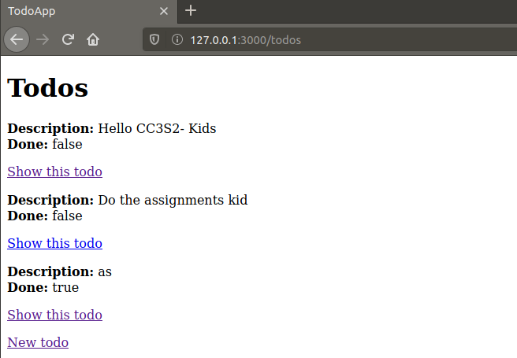

En la ruta /new podemos crear otro todo
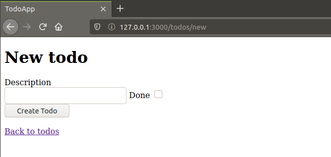

En el archivo routes.rb usamos root todos#index para que la página de todos se muestre en la ruta raíz
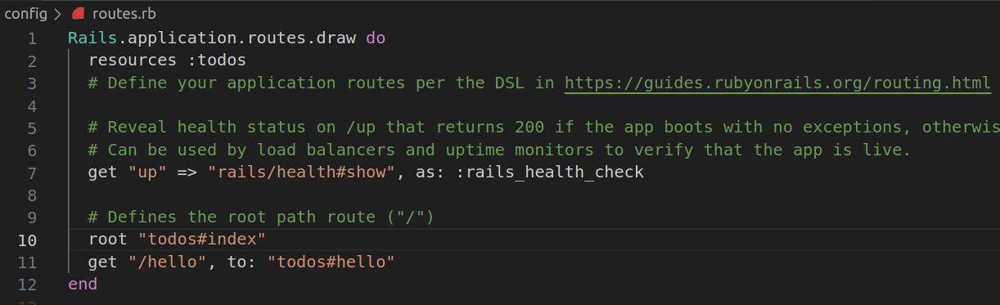
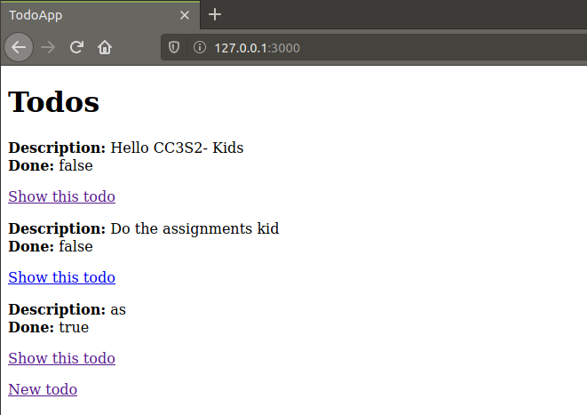

Para enumerar las migraciones creadas usamos rake db:migrate:status y para regresar a una migración anterior usamos rake db:rollback
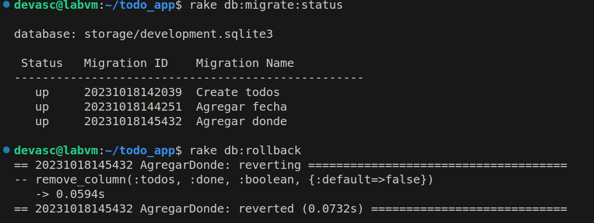